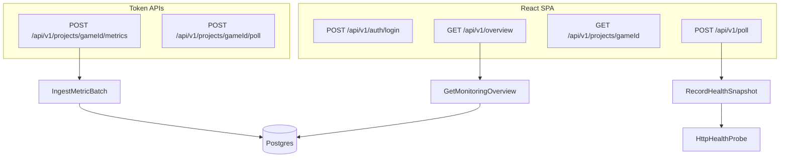

# ProjectMonitoring Architecture

One repo, two apps. The backend is a Symfony 8 / PHP 8.4 JSON API. The frontend is a React + TypeScript SPA with Redux Toolkit Query.

SRWA-style hexagonal / DDD-lite layout on both sides, matching the Loop 9 backend:

## Backend

| Layer | Path | Responsibility |
|---|---|---|
| Model | `backend/src/Model` | Projects, snapshots, metric samples, outbound ports |
| Application | `backend/src/Application` | Use cases and dashboard DTOs |
| Adapter | `backend/src/Adapter` | HTTP JSON, Postgres store, health probe, admin/ingest auth |

Dependencies point inward. HTTP adapters call application services. Application depends only on Model types and ports. The PDO stores and HttpClient implement those ports through aliases in `backend/config/services.yaml`.

## Frontend

| Layer | Path | Responsibility |
|---|---|---|
| Model | `frontend/src/model` | API-facing types and status helpers |
| Adapter / API | `frontend/src/adapter/api` | RTK Query, `X-Admin-Token` |
| Adapter / store | `frontend/src/adapter/store` | Auth token in sessionStorage |
| Adapter / UI | `frontend/src/adapter/ui` | Login, fleet board, project detail |

Pages never call `fetch`. A new screen adds a typed endpoint, then a page that selects from the cache.

## Request pipelines

## V1 scope

- Register games as `Project` rows (`loop9` is seeded from env)
- Poll `/healthz` and `/readyz` on demand or via `bin/console app:poll-health`
- Accept metric batches from game backends (`X-Ingest-Token`)
- Show a fleet board plus a project detail page

Management controls (kill-switch, provider routing, Unreal remote) are out of scope.

## Probes

`HttpHealthProbe` separates three outcomes, because treating them alike makes the console lie:

| Outcome | Status | Meaning |
|---|---|---|
| Answered as expected | `ok` / `ready` | Target is healthy |
| Answered wrong | `error` / `not_ready` | Target is up but unhappy |
| Refused, DNS failure | `down` | Target is unreachable, reason kept in the snapshot |
| No answer in time, twice | `timeout` | Probably asleep, not confirmed dead |

Free hosting tiers drop the request that wakes them, so a timeout is retried once before it is recorded. `PROBE_TIMEOUT_SECONDS` (default 20) sets the budget per attempt.

## Auth

- SPA: `ADMIN_TOKEN` posted to `/api/v1/auth/login`, then sent as `X-Admin-Token`
- Ingest API: per-project `X-Ingest-Token` compared to a SHA-256 hash
- CORS: `CORS_ALLOWED_ORIGINS` lists the origins allowed to call `/api`. An unlisted origin
  gets no `Access-Control-Allow-Origin` header — there is no wildcard fallback, so a
  half-configured deploy fails closed. Empty means localhost only, for development, where
  Vite proxies `/api` anyway.
- The container refuses to boot in `prod` with a missing, example, or too-short
  `ADMIN_TOKEN`, because the image carries development defaults in `.env`.

## Hosting

`render.yaml` describes the whole stack, so the topology is reviewable in the repo instead
of clicked together in a dashboard: a Docker web service for the API, a static site for the
console, managed Postgres, and a cron job running `app:poll-health` every five minutes.

The API image is Apache + PHP 8.4 with `pdo_pgsql`, built in two stages so Composer never
ships into the runtime layer. `docker/entrypoint.sh` binds Apache to Render's `$PORT`,
validates the admin token, and applies the schema before serving. The console build reads
the API's public hostname from `API_HOST`, so no environment has a URL baked into source.

The cron job matters more than it looks: without it, snapshots only exist for moments when
somebody had the page open. Steps are in [DEPLOY.md](DEPLOY.md).

## Persistence

Postgres over plain PDO, no ORM. `DATABASE_URL` points at it; `docker-compose.yml` runs one locally on port 5433.

| Table | Holds |
|---|---|
| `projects` | Registry, keyed by `game_id`, with the ingest token hash |
| `health_snapshots` | Every probe result, indexed on `(game_id, endpoint, checked_at DESC)` |
| `metric_samples` | Ingested samples with `JSONB` tags, indexed on `(game_id, recorded_at DESC)` |

`php bin/console app:db-setup` creates missing tables and seeds the catalog. It is idempotent, so it is safe on every deploy.

This replaced a JSON file store, which read the whole document and wrote it back without locking. That was fine while polling was manual, but a cron poll writing while a game ingests metrics loses one of the two updates with no error. Aggregation (`totals_24h`) now runs as `SUM ... GROUP BY` in the database instead of a PHP loop over every row ever written.
