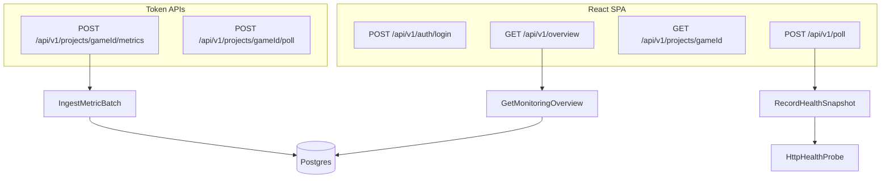

# ProjectMonitoring Architecture

One repo, one API, two clients. The backend is a Symfony 8 / PHP 8.4 JSON API. The console is a
React + TypeScript SPA with Redux Toolkit Query. The phone app is Expo / React Native and reads
the same board.

SRWA-style hexagonal / DDD-lite layout on both sides, matching the Loop 9 backend:

## Backend

| Layer | Path | Responsibility |
|---|---|---|
| Model | `backend/src/Model` | Projects, snapshots, metric samples, outbound ports |
| Application | `backend/src/Application` | Use cases and dashboard DTOs |
| Adapter | `backend/src/Adapter` | HTTP JSON, Postgres store, health probe, admin/ingest auth |

Dependencies point inward. HTTP adapters call application services. Application depends only on Model types and ports. The PDO stores and HttpClient implement those ports through aliases in `backend/config/services.yaml`.

## Clients

| Layer | Path | Responsibility |
|---|---|---|
| Model | `shared/model` | API-facing types and status helpers |
| Adapter / API | `shared/api` | RTK Query, `X-Admin-Token`, base URL injected at start-up |
| Adapter / store | `shared/store` | Auth token in memory, persisted through a platform port |
| Adapter / UI | `shared/ui` | Time and usage formatting, poll-and-wake, see-more |
| Console UI | `frontend/src/adapter/ui` | Login, fleet board, project detail, service buttons |
| Phone UI | `mobile/src` | Sign-in, fleet board, project detail, read-only |

Pages never call `fetch`. A new screen adds a typed endpoint, then a page that selects from the cache.

Everything above the two UI rows is shared, which is the point: a phone and a console disagreeing
about a status word or a bill is worse than either being slightly wrong. Nothing in `shared/`
touches a platform API, and the two things that used to — where the API lives, and where the token
is kept — are handed in by whichever app is running. See [shared/README.md](shared/README.md).

One copy of React serves both, enforced by an override at the workspace root. Files in `shared/`
resolve React from there, and a hook called across two copies of React does not work.

## Request pipelines

## V1 scope

- Register games as `Project` rows (`loop9` is seeded from env)
- Poll `/healthz` and `/readyz` on demand or via `bin/console app:poll-health`
- Accept metric batches from game backends (`X-Ingest-Token`)
- Show a fleet board plus a project detail page
- Read the target's host logs beside its probe history, and the monitor's own logs
- Mail the operator when a target changes state
- Delete a project's probe history from the console
- Read a game's own counters each time a poll finds it up
- Say out loud when the probes themselves have stopped arriving
- Mail the operator when a game's own counters misbehave, not only when it stops answering
- Stop, start and rebuild a target's service at its host, from the project page
- Split a project into health, AI usage, and logs, so spend is not buried under probes
- Read the same board from a phone, with a token that can read and probe but not act
- Push every alert to the registered phones as well as to the inbox

Provider routing and Unreal remote control are still out of scope.

## Probes

`HttpHealthProbe` keeps these outcomes apart, because treating them alike makes the console lie:

| Outcome | Status | Meaning |
|---|---|---|
| Answered as expected | `ok` / `ready` | Target is healthy |
| Answered wrong | `error` / `not_ready` | Target is up but unhappy |
| Refused, DNS failure | `down` | Target is unreachable, reason kept in the snapshot |
| No answer in time, twice | `timeout` | Probably asleep, not confirmed dead |
| `429` twice | `throttled` | Something in front of the target refused us; the target is unjudged |

Free hosting tiers drop the request that wakes them, so a timeout is retried once before it is recorded. `PROBE_TIMEOUT_SECONDS` (default 20) sets the budget per attempt.

One consequence is worth spelling out, because it shaped the console. A sleeping free Render
service cannot be woken by another Render service: the edge refuses the request that would
have started it. So the monitor, sitting on Render, can never wake what it watches. Both the
scheduled run and the Update status button therefore knock first from somewhere else — a
GitHub runner for the schedule, the operator's own browser for the button — and only then ask
the API to measure. Probing without that step reports the network, not the game.

The `throttled` case is not hypothetical. Render sends outbound traffic through IP ranges
shared by every service in a region, and targets behind a CDN rate limit by IP, so a probe
can be refused over traffic that belongs to strangers. The same URL answers `200` from a
home connection at the same moment. Recording that as `error` would blame the game for
someone else's noise, so the probe backs off, retries once, and otherwise records who
refused it.

## Alerts

`AlertChannel` is a port with two implementations behind one alias. `ResendAlertChannel` posts to
an HTTPS API rather than speaking SMTP, because Render blocks ports 25, 465 and 587 on free web
services. `ExpoPushAlertChannel` sends the same alert to the phones. `FanOutAlertChannel` is what
the interface actually resolves to and it sends down both routes, so neither sender knows there
is more than one. `AnnounceHealthChange` holds the decision of what deserves a message, and it
runs before the snapshot is written so the comparison reads history without the row about to
join it.

The two routes are not redundant. Mail is the record: it waits, it is searchable, it survives a
flat battery. Push is the interruption, and only it arrives while the operator is away from a
desk. The fan-out therefore judges failure by whether the human was reached rather than by
whether every route worked — throwing because push failed while the mail went out would leave
the alarm unrecorded and re-raise it on the next poll, charging the operator a duplicate mail
every half hour for one broken route.

The rule is that only conclusive transitions are announced. `throttled` and `timeout` say the
probe could not see the target, so they are skipped entirely: they neither raise an alarm nor
close one, and a recovery still measures the outage from the last real failure. Without that
distinction a sleeping free instance would page an operator every hour and then congratulate
them when it woke up.

A channel that throws is logged and swallowed. The snapshot is the record that matters, and a
mail provider having a bad afternoon must not turn a poll into a failure.

### Alarms from the game's numbers

`AnnounceMetricAlarms` is the second sender, and it exists because uptime is not the same thing
as working. A service can answer every probe while every AI call falls back to a canned reply,
while a whole day passes with nobody playing, or while its counters quietly revert to memory and
report zeros forever. Probes are blind to all three.

Four alarms survived the noise test, and the test was always the same question: would this ring
on a normal day? Three of them compare two states rather than examining one, which is what makes
them safe on an unreleased game. `quiet` needs a day that counted followed by a day that did
not, so a game nobody has played yet says nothing. `players.gone` needs a fall from above zero,
so a permanent zero is silent. `storage.memory` is a real one-off condition. Only `rate:<name>`
takes a threshold, from `ALERT_RATE_PER_HOUR`, because what counts as too many errors an hour is
a property of the game and not of the monitor.

Health alerts can work out "have I already said this" from the probe history, because a probe
writes a row every time. A rate or a level has no such trail — the condition is simply true again
an hour later — so `AlarmStateStore` remembers which keys are raised. State changes only after
the mail is away: recording an alarm that was never delivered would silence it permanently,
which is the one outcome worse than a duplicate. Evaluation runs only when a poll found the game
up, so a down target produces one alert about being down rather than a second about its numbers.

That stored state is also what the console shows, because mail is the wrong place to ask what is
wrong right now: it reports what changed at 3am and says nothing about whether it still holds.
Each card carries its raised alarms oldest first, since "since Saturday" is the part that changes
what an operator does about it. The stored key is translated on the way out — a reader should
never be shown `storage.memory` in the middle of a sentence.

### The one alarm this design cannot send

Every alert above depends on a probe running. Nothing here can announce that the probes
themselves stopped, and stopping is easy: GitHub disables a schedule after 60 days without a
commit, a rotated `ADMIN_TOKEN` makes every run fail, a suspended instance answers nothing. In
all three the console keeps drawing the last statuses it recorded, and green from last week
looks exactly like green from a minute ago. **A monitor's characteristic failure is silence.**

Two things close that, and neither lives in the alert path. The scheduled run reports to an
external heartbeat service after each successful poll, so the complaint about a missing poll
comes from a machine that is not this one; it also reports failures immediately rather than
waiting for a grace period to expire. And `GetMonitoringOverview` publishes the age of the
newest probe with the board, so a fleet page whose data has gone quiet says so instead of
implying the fleet is fine. The heartbeat covers the hours nobody is watching; the banner
covers the moment somebody is. What the banner deliberately does not do is name a culprit it
cannot see: an empty history looks exactly like a stopped schedule from here, and clearing the
history produces that state on purpose for an hour, so blaming the workflow would send a reader
to search something that is working. A poll that answers `200` while probing nothing counts as a
failed run, because a monitor watching zero projects is not a working monitor.

## Talking to the host

`RenderApi` is the only place that holds the Render key and the only place that builds a request
to it. That is not tidiness about secrets: a Render key authorises everything the dashboard can
do, including deleting services, so the set of things it can be used for has to be the set of
calls written in one readable file rather than whatever a compromised browser session invents.
The console never sees the key.

`RenderServiceDirectory` turns a project into the service that answers for it, from the hostname
in its health URL rather than from another column, so registering a project stays a matter of
naming its endpoints. Render appends a suffix to a hostname when the name is taken platform-wide,
so name and hostname can disagree and the URL the host reports is treated as the authority. The
lookup is cached for an hour. A target hosted elsewhere is refused before any request goes out.
Two features need this answer — reading logs and pressing buttons — and one copy of it means one
place to fix when the host changes how names and hostnames relate.

## Logs

`LogSource` is a port with one adapter, `RenderLogSource`, reading through the two classes above.

Everything that can go wrong here — no key, a rejected key, an unknown service, Render being
unreachable — comes back as a note on an empty panel instead of an exception. The probe history
on the same page is the part that matters, and it should not disappear because an optional
integration is misconfigured.

The fleet page reads the monitor's own logs through the same port. When the board looks wrong,
the first question is whether the game is broken or the watcher is, and answering it should not
mean opening the Render dashboard. Render injects `RENDER_SERVICE_ID` into every service, so the
API finds itself without being configured; off Render the panel says so and stays empty. Each
query names one service and only that one, so the fleet panel cannot show a game's lines even
though the monitor's own lines often talk about a game.

A page of lines carries the name of the service that wrote them, and the newest line is first.
Render answers in its own order and does not promise one, and an unattributed panel of log
output next to a second panel of log output is an invitation to read the wrong one.

One kind of line is dropped: Render probes every service's health check path every few seconds
and the web server logs each probe, which comes to roughly eight hundred lines an hour. A panel
holding the newest hundred would therefore hold nothing else, and a warning the application
actually wrote — counters falling back to memory, a history being cleared — could never appear
in it. The panel says how many it left out rather than dropping them silently, because a viewer
that quietly disagrees with the host's own log page teaches its reader to distrust it.

## Game counters

A probe answers whether the web server replied. It cannot say whether players are getting
answers, how often a provider falls over, or which endings runs reach. `GameMetricSource` is the
port for asking the game itself; `HttpGameMetricSource` reads the JSON endpoint Loop 9 publishes.

The monitor pulls rather than the game pushing. A game that reports on a timer needs a scheduler
it does not have and a copy of this API's credentials, to answer a question this API is already
awake to ask on its own schedule. The reading rides along with the poll, and only when the health
probe just came back `ok`: asking a sleeping or rate-limited instance for its counters would
spend the timeout budget again to learn what the probe already reported.

Token spend is one of those counters, not a second integration. Asking the provider's billing
API from here would mean holding their key; the game already sees `usage` on every completion
and publishes `ai.tokens.in`, `ai.tokens.out` and `ai.cost.micros`, plus the same numbers again
under the billed host (`ai.tokens.in.openai`, …). The project page keeps that on its own tab,
with a day-by-day chart from stored readings, so a day of probes does not bury the bill.

The scrape token lives in `METRICS_TOKENS` in the environment, as `gameId=token` pairs, not in
the projects table beside the URL. The ingest token is stored only as a hash for exactly that
reason, and a read-only credential is still a credential.

Counters are cumulative, so a stored reading is a lifetime figure and the window total is the
growth between two of them. Summing them would add yesterday to itself all day. Two kinds of
series therefore share `metric_samples`, told apart by a `kind` tag: pushed samples are events
and still sum, scraped readings are counters and subtract. Growth is measured from the last
reading before the window when there is one, so nothing is lost between polls; a series first
seen inside the window reports zero rather than claiming its lifetime total happened today. A
reading lower than its baseline means the game's counter store was cleared, and the newest
reading is then the whole of what has been counted since.

The `kind` tag is written only here, never accepted from a sender: `IngestMetricBatch` drops it
from a pushed batch. It says how the monitor reads a series rather than anything the game
measured, and a sender able to set it could decide whether its own numbers are summed for the day
or shown as a level and never added up at all.

Not every number is a total. Players online is a level: it is true at the moment it was read and
means nothing added up, so a gauge is stored with `kind=gauge`, kept out of the day's totals, and
shown as its newest reading with the time it was taken. Eleven is not the answer to four players
at nine and seven at ten.

A game that will not answer is logged and skipped. The probe already said whether it is up, and
a missing counter reading is a gap in the numbers, not an incident. An answer with nothing in it
is logged too: a game that has counted nothing and a reading that never happened both show an
empty panel, and only the log tells them apart. The same goes for a game counting into memory
rather than Redis, which it reports in the payload — numbers that die with the process produce a
board of zeros that looks exactly like a quiet day.

## Controls

`ServiceControl` is the one port in this codebase that changes something instead of observing it,
and everything about it is shaped by that. It offers three actions — stop, start, rebuild — each
of which the host's own dashboard already offers and each of which is undone by pressing another
one. Deleting a service, editing its environment and changing its plan are all reachable with the
same key and are deliberately not reachable here: the console is a faster route to a few
reversible operations at 3am, not a second control plane.

Two switches guard it. The key enables reading, and `CONTROLS_ENABLED` enables acting; with the
key alone the panel shows the run state and the buttons stay out of reach. Splitting them is the
point — wanting to read logs and being willing to take a service down are not the same decision,
and the first should not silently grant the second. Every press writes two log lines, one before
the call and one after the host accepts, because a trail with only the second line cannot explain
an outage that began with the first.

A refusal is answered with `409`, not `403`. The console ends its session on `401` and `403`,
which is right when a token has been rotated and wrong for everything else: an operator pressing
Stop and getting signed out would conclude the wrong thing about both. Those two statuses mean the
credential, and any other refusal has to find another code.

Run state is read from the host rather than inferred from probes, because probes cannot make the
distinction that matters most here: a stopped service and a crashed one both fail every check, and
only one of them is worth waking up for. The panel therefore says "stopped on purpose", "deploying
now", or "the last deploy failed, so the previous build is what is running" — sentences an operator
can act on, rather than a status word they have to decode.

The host reports the pre-change state for a while after accepting an action, and that lag is the
one thing the panel has to handle rather than display. It remembers what it asked for, keeps the
buttons shut and says so until the host reports it, and gives up waiting after three quarters of a
minute — a rebuild can finish between two reads. Re-enabling on the answer alone would offer a
second rebuild over a state that is already stale, and the host rate limits these calls to ten a
minute per service.

Stopping is honest about its consequences rather than quiet about them. The confirmation says what
the game loses — no logins, no chat, no telemetry — and that the probes will report it down and
mail about it, because they will: a deliberate outage looks exactly like a real one from outside,
and suppressing that mail would mean teaching the alert path to trust a flag over a measurement.

There is still no record of *who* pressed anything, because a single shared `ADMIN_TOKEN` cannot
tell one operator from another, and naming an actor would be an invention. That is a limit of the
credential, not of the log.

## Deleting history

`ClearHealthHistory` removes every snapshot for one project. It writes a warning to the service
log before returning, and that log is what the fleet page shows. A monitor that can quietly erase
its own evidence is worse than no monitor.

## The phone app

The board, read-only, in a pocket. Fleet overview, one project with health, usage and logs, and
nothing that acts.

It is a second client rather than a second implementation. The API client, the store, the model
and the formatting all come from `shared/`, so what it can drift on is layout. Two differences
from the console are worth naming:

**The token survives a restart.** The console keeps it in `sessionStorage` and forgets it when
the tab closes, because a browser might be on a shared machine. A phone is the operator's own,
and asking them to retype a long secret to glance at the board would mean never glancing at it,
so the token goes in the device keychain. Reading a keychain is asynchronous, which is why the
auth slice carries `restored`: a screen that cannot tell "no token" from "not asked yet" flashes
the sign-in form at somebody who is already signed in.

**The host is typed in, not built in.** Render appends a suffix when a service name is taken, so
the API's hostname is not something a build can be sure of, and an app with the wrong one baked
in would need rebuilding to reach the right one. `EXPO_PUBLIC_API_BASE_URL` is honoured as a
default; without it the app asks once and keeps the answer.

Pull to refresh does what the console's button does — wake the targets from this device, then
ask the API to probe them — for the reason in the Probes section: the monitor cannot wake what it
watches, and a probe sent to a sleeping free instance measures the network rather than the game.

A native app needs no CORS entry, not being a browser origin.

### Alerts on the phone

The app registers itself: it asks Android for permission, asks Expo for a push token, and posts
that token to `/api/v1/devices`, which stores it in `device_tokens`. The table has no project
column, because the app watches the whole fleet and a device told about one game only would be a
worse monitor than the mail it supplements.

Registration happens on every sign-in rather than once, because the operating system can retire a
push route whenever it likes and the server drops any route Expo reports as `DeviceNotRegistered`.
Saying "still here" on each start is how a phone comes back after that. Signing out unregisters
first, while the admin token is still in the store — a phone that signed out and kept buzzing
would be the rudest bug in the app.

Three things outside this repository have to be true before a push arrives: a Firebase project
whose `google-services.json` is in the build, an Expo project whose id is in the app config, and
an FCM key uploaded to that Expo project. All three can be missing, and then the app says "alerts
off" with the reason on the fleet screen instead of failing to open. `app.config.js` wires the
Firebase file in only when it is present, so a clone without it still builds a working board.

`POST /api/v1/devices` is the one write the read-only token may perform, and that is the point
rather than an oversight: the read-only rule exists so a lost phone cannot touch the
infrastructure, and asking to be told when something breaks touches nothing.

## Auth

- SPA: `ADMIN_TOKEN` posted to `/api/v1/auth/login`, then sent as `X-Admin-Token`
- Phone: `ADMIN_READONLY_TOKEN` sent as `X-Admin-Token`, checked once at `/api/v1/auth/session`
- Ingest API: per-project `X-Ingest-Token` compared to a SHA-256 hash
- CORS: `CORS_ALLOWED_ORIGINS` lists the origins allowed to call `/api`. An unlisted origin
  gets no `Access-Control-Allow-Origin` header — there is no wildcard fallback, so a
  half-configured deploy fails closed. Empty means localhost only, for development, where
  Vite proxies `/api` anyway.
- The container refuses to boot in `prod` with a missing, example, or too-short
  `ADMIN_TOKEN`, because the image carries development defaults in `.env`.

### Two levels, and why the second one exists

`AdminAuthenticator` answers two questions instead of one: may this caller read, and may it act.
The full token does both. The read-only token reads and may ask for a probe, and every endpoint
that changes something checks the second question separately.

The reason is the phone. A device that leaves the house should not be able to take a service
down, and the alternative — carrying the full token because that is the only one there is —
would mean the most exposed copy of the credential is also the most powerful. Short secrets
count as unset on both, so a half-filled environment fails closed rather than accepting `x`.

Probing sits on the reading side deliberately. It writes a snapshot, so it is not a pure read,
but a monitor that cannot ask for a fresh measurement is a screenshot: the schedule runs every
half hour and a phone opened in between would show a board that stale, which is the opposite of
what it is for. Nothing about a probe is destructive, and a target answering a question is not a change to
the target.

A refusal aimed at the read-only token throws `WriteAccessDenied`, which reaches the client as
`403` with `code: "FORBIDDEN"` instead of `UNAUTHORIZED`. This is the same trap the `409` on a
refused control action avoids, arrived at from the other direction: the clients end a session on
`401` and `403` because that is what a rotated token looks like, so a refusal that means
"correct token, wrong request" has to be distinguishable or a read-only client signs itself out
of the board over a button it should never have been shown. The shared API client checks for that
code before clearing the token.

Read-only is header-only and cannot open a console session. Letting it in would produce a
console full of controls that every click refuses, which is a worse answer than not offering
them.

## Hosting

`render.yaml` describes the topology, so it is reviewable in the repo instead of clicked
together in a dashboard: a Docker web service for the API and a static site for the console,
both on free instances. Postgres is a Supabase project and the schedule is a GitHub Actions
workflow, because Render bills for managed Postgres and has no free cron.

The API image is Apache + PHP 8.4 with `pdo_pgsql`, built in two stages so Composer never
ships into the runtime layer. `docker/entrypoint.sh` binds Apache to Render's `$PORT`,
validates the admin token, and applies the schema before serving. The console build reads
the API's public hostname from `API_HOST`, so no environment has a URL baked into source.

The console is built from the repository root rather than from `frontend/`, because an install
rooted there cannot reach `shared/` one level above it. Its build filter therefore watches
`shared/` too: a change to the API client is a change to the console. The phone app is not
hosted — it is built with EAS or run through Expo Go — so it has no service in the blueprint.

`PostgresConnection` recognises a transaction-mode pooler (port 6543 or `pgbouncer=true`)
and switches PDO to client-side prepared statements, since a pooled connection can hand
consecutive statements to different backends.

The schedule matters more than it looks: without it, snapshots would only exist for moments
when somebody had the page open, and the free instance would sleep between visits. Steps
are in [DEPLOY.md](DEPLOY.md).

## Persistence

Postgres over plain PDO, no ORM. `DATABASE_URL` points at it; `docker-compose.yml` runs one locally on port 5433.

| Table | Holds |
|---|---|
| `projects` | Registry, keyed by `game_id`, with the ingest token hash |
| `health_snapshots` | Every probe result, indexed on `(game_id, endpoint, checked_at DESC)` |
| `metric_samples` | Ingested samples with `JSONB` tags, indexed on `(game_id, recorded_at DESC)` |
| `metric_alarms` | One row per raised alarm, so a standing warning is mailed once and not every poll |
| `device_tokens` | Phones to push alerts to. No `game_id`: the app watches the whole fleet |

`php bin/console app:db-setup` creates missing tables and seeds the catalog. It is idempotent, so it is safe on every deploy.

This replaced a JSON file store, which read the whole document and wrote it back without locking. That was fine while polling was manual, but a cron poll writing while a game ingests metrics loses one of the two updates with no error. Aggregation (`totals_24h`) now runs as `SUM ... GROUP BY` in the database instead of a PHP loop over every row ever written.
