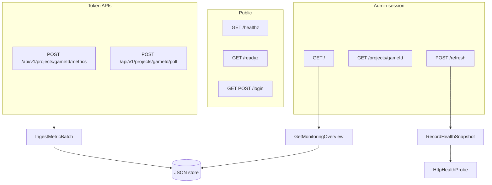

# ProjectMonitoring Architecture

Symfony 8 / PHP 8.4 monitoring console for Loop 9 and future games.

SRWA-style hexagonal / DDD-lite layout, matching the Loop 9 backend:

| Layer | Path | Responsibility |
|---|---|---|
| Model | `src/Model` | Projects, snapshots, metric samples, outbound ports |
| Application | `src/Application` | Use cases and dashboard DTOs |
| Adapter | `src/Adapter` | HTTP, Twig, JSON file store, health probe, admin/ingest auth |

Dependencies point inward. HTTP adapters call application services. Application depends only on Model types and ports. The JSON store and HttpClient implement those ports through aliases in `config/services.yaml`.

## Request pipelines

## V1 scope

- Register games as `Project` rows (`loop9` is seeded from env)
- Poll `/healthz` and `/readyz` on demand or via `bin/console app:poll-health`
- Accept metric batches from game backends (`X-Ingest-Token`)
- Show a single-screen fleet dashboard plus a project detail page

Management controls (kill-switch, provider routing, Unreal remote) are out of scope.

## Auth

- Admin web: shared `ADMIN_TOKEN` stored in a session cookie after `/login`
- Admin API: `X-Admin-Token`
- Ingest API: per-project `X-Ingest-Token` compared to a SHA-256 hash

## Persistence

JSON document store at `DATABASE_PATH` (default `var/data/monitoring.json`). Created on first boot. No Doctrine. Repository ports stay stable if a later adapter swaps in Postgres.
