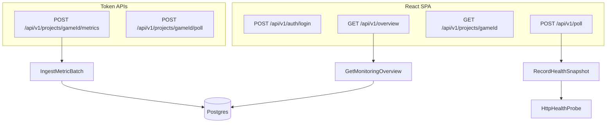

# ProjectMonitoring Architecture

One repo, two apps. The backend is a Symfony 8 / PHP 8.4 JSON API. The frontend is a React + TypeScript SPA with Redux Toolkit Query.

SRWA-style hexagonal / DDD-lite layout on both sides, matching the Loop 9 backend:

## Backend

| Layer | Path | Responsibility |
|---|---|---|
| Model | `backend/src/Model` | Projects, snapshots, metric samples, outbound ports |
| Application | `backend/src/Application` | Use cases and dashboard DTOs |
| Adapter | `backend/src/Adapter` | HTTP JSON, Postgres store, health probe, admin/ingest auth |

Dependencies point inward. HTTP adapters call application services. Application depends only on Model types and ports. The PDO stores and HttpClient implement those ports through aliases in `backend/config/services.yaml`.

## Frontend

| Layer | Path | Responsibility |
|---|---|---|
| Model | `frontend/src/model` | API-facing types and status helpers |
| Adapter / API | `frontend/src/adapter/api` | RTK Query, `X-Admin-Token` |
| Adapter / store | `frontend/src/adapter/store` | Auth token in sessionStorage |
| Adapter / UI | `frontend/src/adapter/ui` | Login, fleet board, project detail |

Pages never call `fetch`. A new screen adds a typed endpoint, then a page that selects from the cache.

## Request pipelines

## V1 scope

- Register games as `Project` rows (`loop9` is seeded from env)
- Poll `/healthz` and `/readyz` on demand or via `bin/console app:poll-health`
- Accept metric batches from game backends (`X-Ingest-Token`)
- Show a fleet board plus a project detail page
- Read the target's host logs beside its probe history, and the monitor's own logs
- Mail the operator when a target changes state
- Delete a project's probe history from the console
- Read a game's own counters each time a poll finds it up

Management controls (kill-switch, provider routing, Unreal remote) are out of scope.

## Probes

`HttpHealthProbe` keeps these outcomes apart, because treating them alike makes the console lie:

| Outcome | Status | Meaning |
|---|---|---|
| Answered as expected | `ok` / `ready` | Target is healthy |
| Answered wrong | `error` / `not_ready` | Target is up but unhappy |
| Refused, DNS failure | `down` | Target is unreachable, reason kept in the snapshot |
| No answer in time, twice | `timeout` | Probably asleep, not confirmed dead |
| `429` twice | `throttled` | Something in front of the target refused us; the target is unjudged |

Free hosting tiers drop the request that wakes them, so a timeout is retried once before it is recorded. `PROBE_TIMEOUT_SECONDS` (default 20) sets the budget per attempt.

One consequence is worth spelling out, because it shaped the console. A sleeping free Render
service cannot be woken by another Render service: the edge refuses the request that would
have started it. So the monitor, sitting on Render, can never wake what it watches. Both the
scheduled run and the Update status button therefore knock first from somewhere else — a
GitHub runner for the schedule, the operator's own browser for the button — and only then ask
the API to measure. Probing without that step reports the network, not the game.

The `throttled` case is not hypothetical. Render sends outbound traffic through IP ranges
shared by every service in a region, and targets behind a CDN rate limit by IP, so a probe
can be refused over traffic that belongs to strangers. The same URL answers `200` from a
home connection at the same moment. Recording that as `error` would blame the game for
someone else's noise, so the probe backs off, retries once, and otherwise records who
refused it.

## Alerts

`AlertChannel` is a port; `ResendAlertChannel` posts to an HTTPS API rather than speaking SMTP,
because Render blocks ports 25, 465 and 587 on free web services. `AnnounceHealthChange` holds
the decision of what deserves a message, and it runs before the snapshot is written so the
comparison reads history without the row about to join it.

The rule is that only conclusive transitions are announced. `throttled` and `timeout` say the
probe could not see the target, so they are skipped entirely: they neither raise an alarm nor
close one, and a recovery still measures the outage from the last real failure. Without that
distinction a sleeping free instance would page an operator every hour and then congratulate
them when it woke up.

A channel that throws is logged and swallowed. The snapshot is the record that matters, and a
mail provider having a bad afternoon must not turn a poll into a failure.

## Logs

`LogSource` is a port with one adapter, `RenderLogSource`. The console never talks to Render:
it asks this API, which holds the key. That is the whole reason the port exists — a Render key
authorises everything the dashboard can do, so the set of things it can be used for has to be
the set of things this codebase implements, not whatever a compromised browser session invents.

The Render service is resolved from the hostname in the project's health URL rather than stored
as another column, so registering a project stays a matter of naming its endpoints. The lookup
is cached for an hour. A target hosted elsewhere is refused before any request goes out.

Everything that can go wrong here — no key, a rejected key, an unknown service, Render being
unreachable — comes back as a note on an empty panel instead of an exception. The probe history
on the same page is the part that matters, and it should not disappear because an optional
integration is misconfigured.

The fleet page reads the monitor's own logs through the same port. When the board looks wrong,
the first question is whether the game is broken or the watcher is, and answering it should not
mean opening the Render dashboard. Render injects `RENDER_SERVICE_ID` into every service, so the
API finds itself without being configured; off Render the panel says so and stays empty. Each
query names one service and only that one, so the fleet panel cannot show a game's lines even
though the monitor's own lines often talk about a game.

A page of lines carries the name of the service that wrote them, and the newest line is first.
Render answers in its own order and does not promise one, and an unattributed panel of log
output next to a second panel of log output is an invitation to read the wrong one.

## Game counters

A probe answers whether the web server replied. It cannot say whether players are getting
answers, how often a provider falls over, or which endings runs reach. `GameMetricSource` is the
port for asking the game itself; `HttpGameMetricSource` reads the JSON endpoint Loop 9 publishes.

The monitor pulls rather than the game pushing. A game that reports on a timer needs a scheduler
it does not have and a copy of this API's credentials, to answer a question this API is already
awake to ask on its own schedule. The reading rides along with the poll, and only when the health
probe just came back `ok`: asking a sleeping or rate-limited instance for its counters would
spend the timeout budget again to learn what the probe already reported.

The scrape token lives in `METRICS_TOKENS` in the environment, as `gameId=token` pairs, not in
the projects table beside the URL. The ingest token is stored only as a hash for exactly that
reason, and a read-only credential is still a credential.

Counters are cumulative, so a stored reading is a lifetime figure and the window total is the
growth between two of them. Summing them would add yesterday to itself all day. Two kinds of
series therefore share `metric_samples`, told apart by a `kind` tag: pushed samples are events
and still sum, scraped readings are counters and subtract. Growth is measured from the last
reading before the window when there is one, so nothing is lost between polls; a series first
seen inside the window reports zero rather than claiming its lifetime total happened today. A
reading lower than its baseline means the game's counter store was cleared, and the newest
reading is then the whole of what has been counted since.

The `kind` tag is written only here, never accepted from a sender: `IngestMetricBatch` drops it
from a pushed batch. It says how the monitor reads a series rather than anything the game
measured, and a sender able to set it could decide whether its own numbers are summed for the day
or shown as a level and never added up at all.

Not every number is a total. Players online is a level: it is true at the moment it was read and
means nothing added up, so a gauge is stored with `kind=gauge`, kept out of the day's totals, and
shown as its newest reading with the time it was taken. Eleven is not the answer to four players
at nine and seven at ten.

A game that will not answer is logged and skipped. The probe already said whether it is up, and
a missing counter reading is a gap in the numbers, not an incident. An answer with nothing in it
is logged too: a game that has counted nothing and a reading that never happened both show an
empty panel, and only the log tells them apart. The same goes for a game counting into memory
rather than Redis, which it reports in the payload — numbers that die with the process produce a
board of zeros that looks exactly like a quiet day.

## Deleting history

`ClearHealthHistory` removes every snapshot for one project. It is the only destructive action in
the API, so it writes a warning to the service log before returning, and that log is what the
fleet page now shows. A monitor that can quietly erase its own evidence is worse than no monitor.

There is no audit table yet and no record of who pressed the button, because a single shared
`ADMIN_TOKEN` cannot tell one operator from another. Naming an actor would be an invention. When
control actions arrive and more than one person holds a credential, both problems get solved
together rather than half-solved now.

## Auth

- SPA: `ADMIN_TOKEN` posted to `/api/v1/auth/login`, then sent as `X-Admin-Token`
- Ingest API: per-project `X-Ingest-Token` compared to a SHA-256 hash
- CORS: `CORS_ALLOWED_ORIGINS` lists the origins allowed to call `/api`. An unlisted origin
  gets no `Access-Control-Allow-Origin` header — there is no wildcard fallback, so a
  half-configured deploy fails closed. Empty means localhost only, for development, where
  Vite proxies `/api` anyway.
- The container refuses to boot in `prod` with a missing, example, or too-short
  `ADMIN_TOKEN`, because the image carries development defaults in `.env`.

## Hosting

`render.yaml` describes the topology, so it is reviewable in the repo instead of clicked
together in a dashboard: a Docker web service for the API and a static site for the console,
both on free instances. Postgres is a Supabase project and the schedule is a GitHub Actions
workflow, because Render bills for managed Postgres and has no free cron.

The API image is Apache + PHP 8.4 with `pdo_pgsql`, built in two stages so Composer never
ships into the runtime layer. `docker/entrypoint.sh` binds Apache to Render's `$PORT`,
validates the admin token, and applies the schema before serving. The console build reads
the API's public hostname from `API_HOST`, so no environment has a URL baked into source.

`PostgresConnection` recognises a transaction-mode pooler (port 6543 or `pgbouncer=true`)
and switches PDO to client-side prepared statements, since a pooled connection can hand
consecutive statements to different backends.

The schedule matters more than it looks: without it, snapshots would only exist for moments
when somebody had the page open, and the free instance would sleep between visits. Steps
are in [DEPLOY.md](DEPLOY.md).

## Persistence

Postgres over plain PDO, no ORM. `DATABASE_URL` points at it; `docker-compose.yml` runs one locally on port 5433.

| Table | Holds |
|---|---|
| `projects` | Registry, keyed by `game_id`, with the ingest token hash |
| `health_snapshots` | Every probe result, indexed on `(game_id, endpoint, checked_at DESC)` |
| `metric_samples` | Ingested samples with `JSONB` tags, indexed on `(game_id, recorded_at DESC)` |

`php bin/console app:db-setup` creates missing tables and seeds the catalog. It is idempotent, so it is safe on every deploy.

This replaced a JSON file store, which read the whole document and wrote it back without locking. That was fine while polling was manual, but a cron poll writing while a game ingests metrics loses one of the two updates with no error. Aggregation (`totals_24h`) now runs as `SUM ... GROUP BY` in the database instead of a PHP loop over every row ever written.
